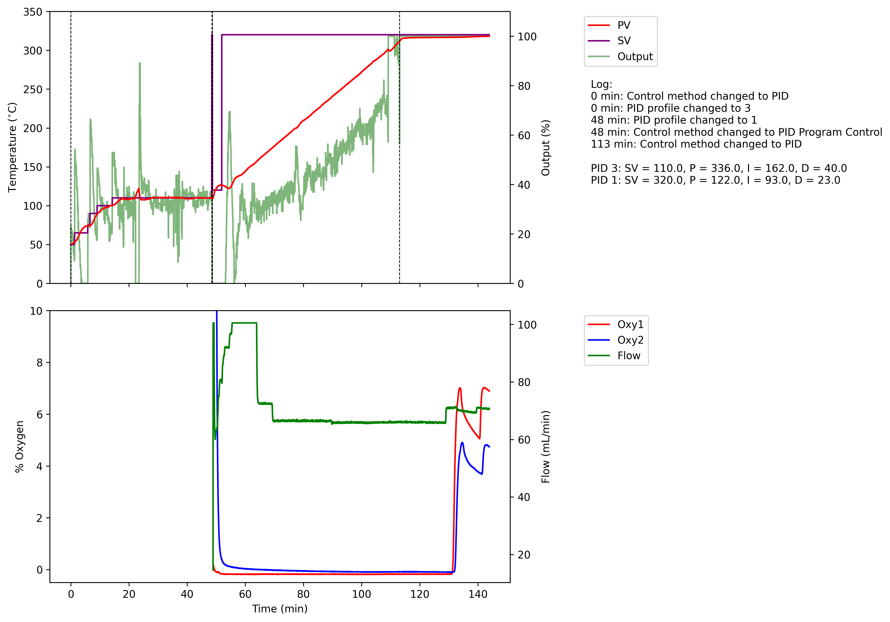

# reaction_monitor
An Arduino-based data logger for logging temperature, gas flow, and gas composition data from chemical reactions.

## Motivation

Several projects in our research group focus on synthesis of nanoparticles under carefully controlled conditions involving temperature programs, gas flow rate, and gas composition (for N2/O2 mixtures), all of which were recorded manually. We sought to use readily available components (many of which are common in academic research labs or are otherwise low-cost) which would automate the data logging.

## Overview

    

The heart of the reaction monitor is an Arduino Mega. The Arduino communicates with an [Omega PID controller](https://www.omega.ca/en/control-monitoring/controllers/pid-controllers/p/CN7200-Series) via its MODBUS serial interface. [Gas flow](https://www.mcmflow.com/product/model-100/) and [oxygen sensors](https://www.apogeeinstruments.com/so-110-soil-response-thermistor-reference-oxygen-sensor/) output 0 - 3.3 V signals which are read by [16-bit ADCs](https://www.adafruit.com/product/1085) and sent to the Arduino via the I2C protocol. 

Two oxygen sensors are available and are intended to be put before and after the reaction. Our reactions bubble the gas through an aqueous reaction, so the the first oxygen sensor (OXY1) is calibrated under dry conditions and the second (OXY2) is calibrated under wet conditions. The Arduinio logs raw voltages from the sensors in addition to the calculated oxygen percentages, so oxygen percentages can always be recalculated during data workup (as is done in the [example data workup](sample_data_workup.ipynb)). The calibration procedure for the oxygen sensors are available in the [Apogee manual](assets/SO-100-200-manual.pdf), and our calibration data for both wet and dry conditions are available in [/calibration](calibration). The oxygen percentage calculations account for humidity. In our Arduino code, we assume 0% humidity for OXY1 as it measures a gas mixture directly from cylinders with dry gas. We placed a [temperature, pressure and humidty sensor](https://www.adafruit.com/product/2652) after OXY2 to calculate the post-reaction oxygen percentage. The humidity sensor is placed in a 3D printd enclosure available in [/materials](materials)

The electronics are housed in a 3D printed enclosure, also available in [/materials](materials). The enclosure includes two LCDs displaying basic information on oxygen percentages, gas flow rates, time, PID values (process value, set value, and output), and, when recording data, the name of the file being written. Data is recorded to a micro SD card. Recording is started/stopped by pressing the button on the front of the enclosure. When recording, a red LED will be lit and a blue LED will flash each time a data point is collected (which is every second in our code).

    

## Example Usage

The [example data workup notebook](sample_data_workup.ipynb) uses data file [RXN00026.CSV](sample_data/RXN00026.CSV). This data was collected during a reaction followed the procedure detailed in [Kirkpatrick _et al._ Size-Tunable Magnetite Nanoparticles from Well-Defined Iron Oleate Precursors, Chemistry of Materials, 2022](https://pubs.acs.org/doi/10.1021/acs.chemmater.2c02046) ([free copy here](https://drive.google.com/file/d/1hveF1zS2nrNvON7UYBfMMZ2yYlZfvH2g/view)). In short, the synthesis of magnetite nanoparticles uses vacuum, then an N2 atmosphere during the initial heating of the reaction mixture. Once the reaction is under reflux a small amount of oxygen is introduced into the gas mixture. The size, shape, and presence/absence of core-shelling can be affected by precise control of the gas flow, composition, and temperature profile. The reaction monitor records every aspect of these reaction conditions, including any user-intervention with the PID controller.

    

## Future Work

While our primary goals were to provide automated data logging, the initial data indicates the possibility of moving towards fully automated reactions. In the example reaction discussed above, the timing of introducing O2 into the reaction affects the phase of the final particles and whether or not they will have core-shelling. Presently, O2 is introduced when the chemist running the reaction first observes reflux. We could instead rely upon the data read from the PID controller. Specifically, the "output" data corresponds to how much heat is being put into the reaction (on a 0-100 scale). In the sample data, the start of reflux can be seen at the point where output is persistently at 100 and the process value (PV) has not yet reached the set value (SV). Replacing the passive gas sensors with mass flow controllers would allow for both monitoring and control of the reaction conditions. 
